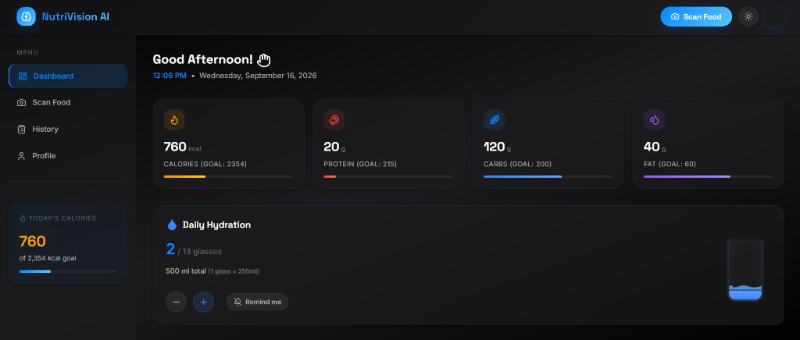
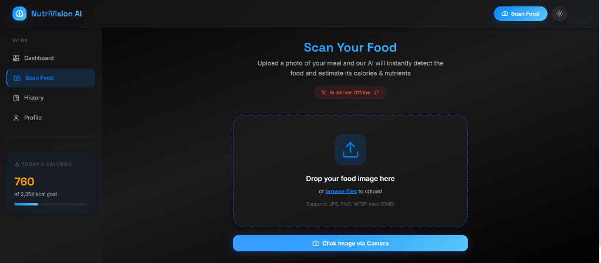
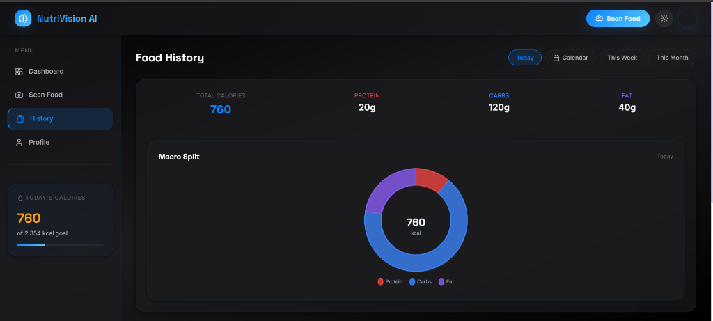
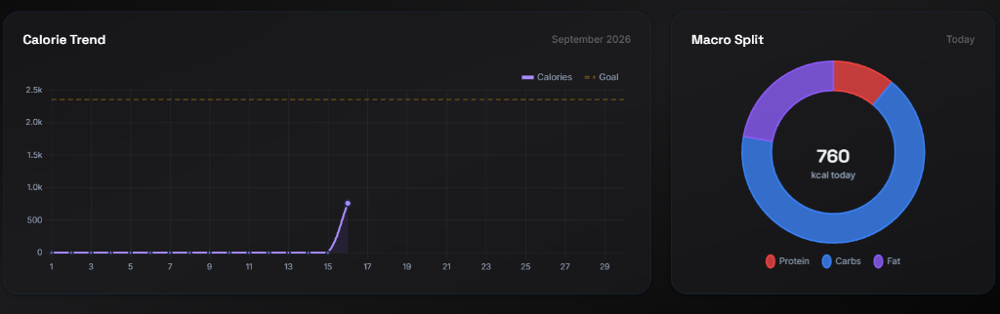
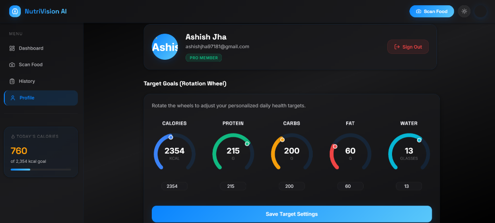

<div align="center">
  <h1>🍏 NutriVision AI</h1>
  <p><em>Your Personal AI-Powered Nutrition & Health Manager</em></p>
</div>



## 📖 Overview

**NutriVision AI** is an intelligent health and nutrition tracking application that revolutionizes how you log your meals. Instead of manually searching for foods and estimating portion sizes, simply snap a picture! Our advanced AI instantly analyzes the image, detects the food items, and estimates the precise nutritional breakdown (Calories, Protein, Carbs, and Fat). 

With a sleek, modern dashboard, personalized health targets, and historical trend tracking, NutriVision AI makes achieving your fitness and dietary goals effortless and engaging.

---

## ✨ Key Features

* **📸 AI-Powered Food Scanning:** Upload or snap a picture of your meal. The backend AI (powered by Google Gemini Vision) automatically identifies the food and provides a detailed nutritional breakdown.
* **📊 Comprehensive Dashboard:** Get a bird's-eye view of your daily progress. Track Calories, Protein, Carbs, and Fats against your customized daily goals.
* **💧 Hydration Tracker:** Stay on top of your daily water intake with quick-add buttons and a visual tracking interface.
* **📈 Historical Trends & Analytics:** Visualize your daily macro splits with beautiful pie charts and track your calorie intake over time with interactive line charts.
* **🎯 Personalized Goals:** Customize your daily macronutrient targets using our intuitive rotation wheels.
* **🔐 Secure Authentication:** Seamless user login and secure profile management.

---

## 💻 Tech Stack

* **Frontend:** React.js (Vite), React Router, Chart.js (react-chartjs-2), Lucide Icons
* **Backend:** Python, FastAPI, Uvicorn
* **AI & Machine Learning:** Google Gemini AI / PyTorch for deep image analysis & nutritional estimation.
* **Database & Auth:** Clerk (Authentication), Supabase / Firebase

---

## 🚀 Getting Started

### Prerequisites
* Node.js (v18+)
* Python (3.10+)

### Installation & Setup

1. **Clone the repository:**
   ```bash
   git clone https://github.com/ashishjha0125/HealthManagment.git
   cd HealthManagment
   ```

2. **Backend Setup:**
   ```bash
   # Create a virtual environment (optional but recommended)
   python -m venv venv
   source venv/bin/activate  # On Windows: venv\Scripts\activate

   # Install Python dependencies
   pip install -r requirements.txt
   
   # Set up environment variables
   # Copy .env.example to .env and add your GEMINI_API_KEY
   ```

3. **Frontend Setup:**
   ```bash
   # Install NPM packages
   npm install
   ```

4. **Run the Application:**
   ```bash
   # Start both frontend (Vite) and backend (FastAPI) concurrently
   npm start
   ```

   * The Frontend will run on `http://localhost:5173`
   * The Backend API will run on `http://localhost:8000`

---

## 📸 Screenshots

### AI Food Scanning

*Simply drop an image or use your camera to instantly analyze your meal's nutritional value.*

### Detailed History & Analytics


*Track your macros with intuitive pie charts and visualize your progress over time with trend lines.*

### Personalized Profile Settings

*Adjust your daily targets with our interactive rotation wheels.*

---

## 🤝 Contributing
Contributions are welcome! Feel free to open issues or submit pull requests to help improve NutriVision AI.

---
⭐ **If you find this project useful, please consider giving it a star on GitHub!**
